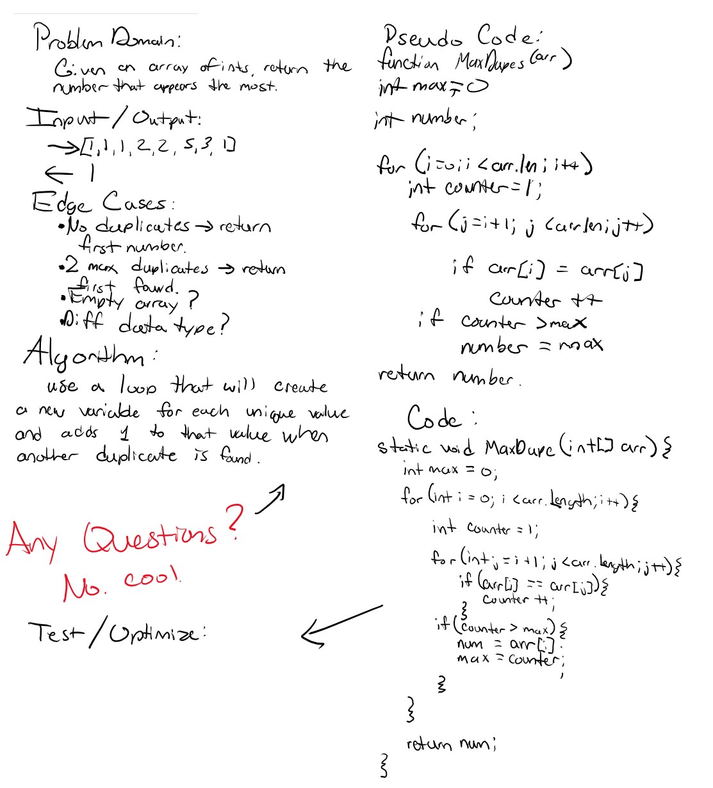
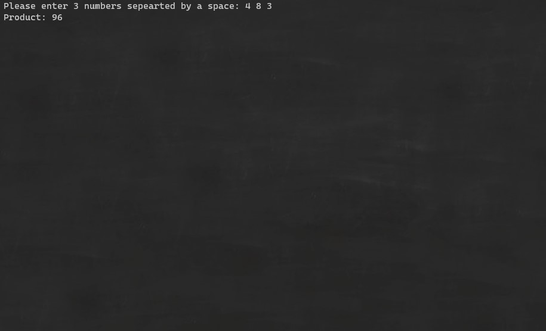

# Lab03-Review Challenges
---

Lab03-SystemIO

*Author: Andrew Smith*

---

## Description 
---

This repository contains 9 coding challenges that cover the material learned in 
week 1, of the 401 ASP.NET Core course. 

---

## Getting Started
---

Clone down repo:
`$ git clone [https://github.com/AndrewCS149/Lab03-Review.git]`

Once in root directory navigate to:
`cd .\Review\Review\bin\debug\netcoreapp3.1`

Then run:
`start .\Review.exe`

---

## Visuals
---

WhiteBoard - Challenge 3:

Visuals for the challenges that require user input:

GetProduct()

GetAvg()

PrintDiamond()

---

## Change Log
---

* 8 Jul 2020
	* Project Initialized
	* GetProduct() method added
	* GetAvgSetup() method added
	* GetAvg() method added
	* PrintDiamond() method added
	* MaxDupe() method added
	* MaxNum() method added
	* CharCount() method added
	* SaveToFile() method added
	* ReadFromFile() method added
	* RewriteWord() method added